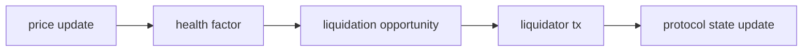

## 清算不是单一公式

清算机制表面上是抵押率判断，实际涉及价格来源、债仓状态、清算激励、交易执行和链上拥堵。

## 风险链路

```mermaid
flowchart LR
  A["price update"] --> B["health factor"]
  B --> C["liquidation opportunity"]
  C --> D["liquidator tx"]
  D --> E["protocol state update"]
```

## 评估重点

- 预言机延迟和异常价格。
- 清算奖励是否覆盖执行成本。
- 极端行情下的链上拥堵。
- 协议坏账处理机制。
