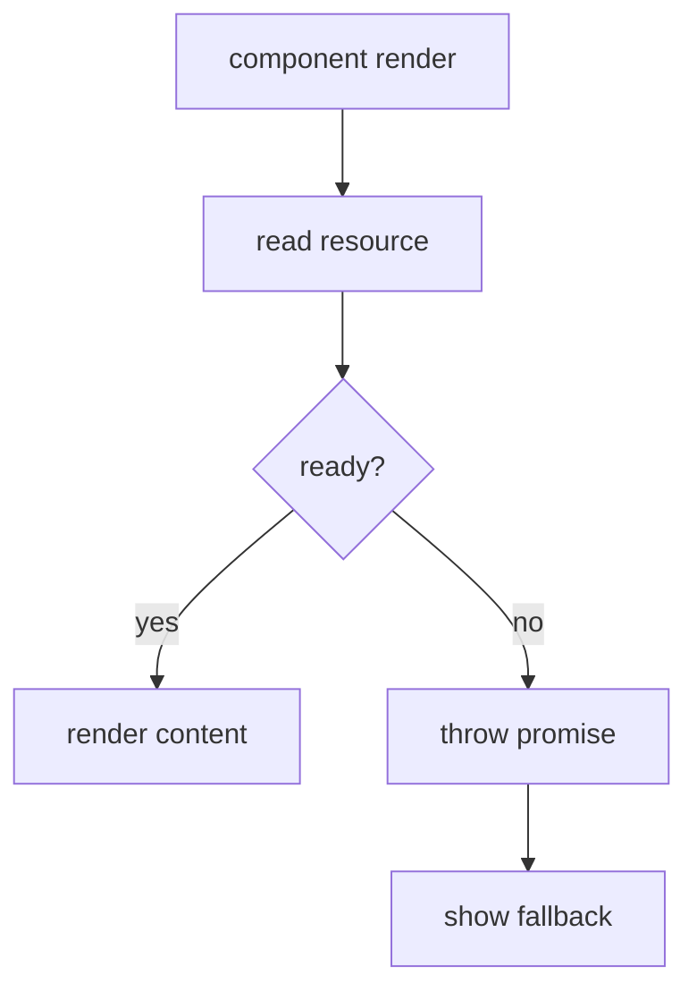

## Suspense 不是请求库

Suspense 更接近一种渲染协调机制。它让组件可以表达“当前还不能完整渲染”，但缓存、请求生命周期和错误恢复仍然需要明确设计。

## 数据流模型

```mermaid
flowchart TD
  A["component render"] --> B["read resource"]
  B --> C{"ready?"}
  C -->|yes| D["render content"]
  C -->|no| E["throw promise"]
  E --> F["show fallback"]
```

## 工程判断

如果业务只是普通列表加载，不需要强行引入 Suspense。它更适合框架级数据层、路由级 loading 边界和复杂交互中的一致体验。
