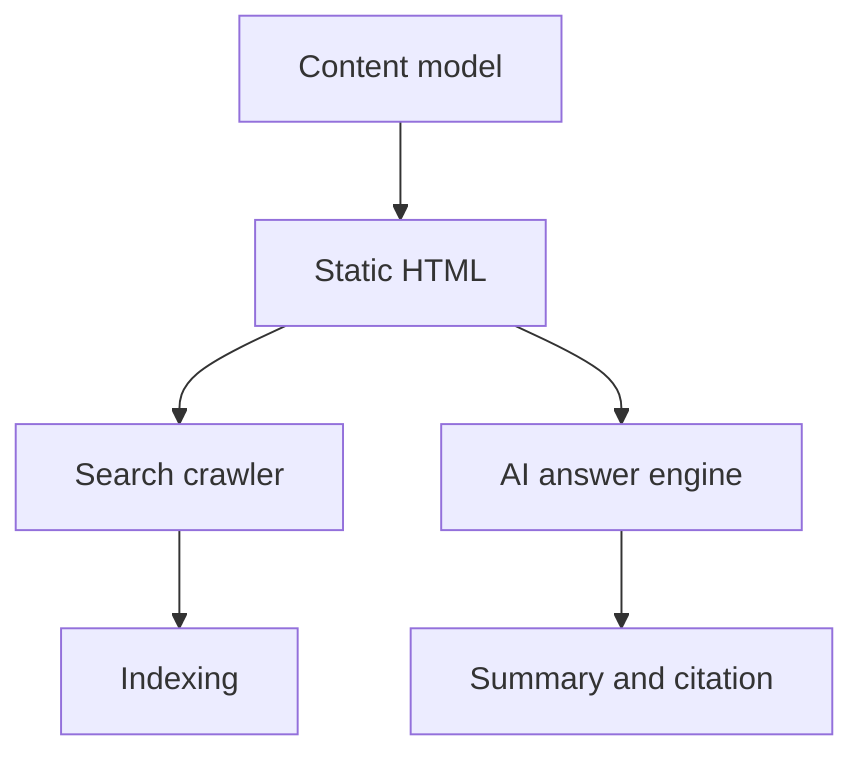

## 为什么单独做排版测试

技术文章不是营销落地页。它需要读者在扫描标题、阅读段落、复制代码、理解图表之间频繁切换。排版系统如果只看首页，会很容易忽略正文里的真实压力。

这篇文章故意混合多种内容形态：长标题、短段落、嵌套列表、代码块、表格、图片、引用和 Mermaid 图。它的目的不是讲一个新概念，而是验证站点的阅读层级是否稳定。

> 判断标准很简单：读者应该能在 5 秒内知道文章结构，在 30 秒内找到关键代码，在 3 分钟内读完一个完整小节。

## H2：模块边界不是目录结构

目录结构通常只是结果。真正的边界来自依赖方向、变更范围和公开 API。如果一个 `shared` 模块反向依赖业务 feature，目录看起来再干净也没有意义。


图中展示的是一种常见前端依赖方向：`app -> pages -> features -> entities -> shared`。这不是唯一正确答案，但它能帮助团队讨论“谁可以依赖谁”。

### H3：依赖方向需要可执行

只在文档里写规则没有用。规则需要进入代码审查、lint、目录约定和项目脚手架。否则边界会在几次紧急迭代后逐渐失效。

#### H4：最小可执行规则

下面是一个简化的边界检查配置。真实项目可以用 ESLint、dependency-cruiser 或 Nx enforce module boundaries 来实现。

```ts
type Layer = 'app' | 'pages' | 'features' | 'entities' | 'shared';

const allowedDependencies: Record<Layer, Layer[]> = {
  app: ['pages', 'features', 'entities', 'shared'],
  pages: ['features', 'entities', 'shared'],
  features: ['entities', 'shared'],
  entities: ['shared'],
  shared: [],
};

export function canImport(from: Layer, target: Layer) {
  return allowedDependencies[from].includes(target);
}
```

### H3：列表层级测试

技术文档经常需要多级列表。这里测试 L1、L2、L3 的缩进、行高和段落间距。

- L1：模块边界应该用工程规则保护。
  - L2：例如限制 feature 之间互相 import。
  - L2：例如禁止 shared 读取业务状态。
    - L3：如果确实需要复用，先抽象稳定接口。
    - L3：不要把临时业务分支塞进底层工具。
- L1：代码审查应该检查依赖方向。
  - L2：Review comment 要能指向具体文件。
  - L2：规则需要自动化，否则成本太高。

## H2：图文混排与说明文字

图片在技术文章里通常承担两类任务：解释系统结构，或展示运行结果。图片不能只作为装饰元素，它需要明确的 alt 和上下文说明。

<figure>
  
  <figcaption>一个受约束的 AI Review 工作流：模型负责提出建议，人负责最终判断。</figcaption>
</figure>

### H3：图片后的正文

图片后面的段落需要自然接回文章，而不是让读者感觉进入了另一个版块。这里验证 `figure`、`figcaption` 和普通段落之间的距离。

## H2：代码块与行内代码

正文中的行内代码例如 `pnpm build`、`getStaticPaths`、`Content Collections` 应该清晰但不能太跳。代码块则需要足够宽、可横向滚动，并且不挤压正文。

```tsx
export async function getStaticPaths() {
  const posts = await getPublishedPosts();

  return posts.map((post) => ({
    params: { slug: post.data.slug },
    props: { post },
  }));
}
```

下面是一个更长的代码块，用于验证横向滚动和视觉密度。

```ts
const articleMetadata = {
  title: '技术文档排版测试：标题、图文、代码与列表层级',
  description: '校准技术文章阅读体验，覆盖标题、正文、图片、代码块、表格、引用、嵌套列表和 Mermaid。',
  canonical: '/writing/technical-writing-layout-playbook/',
  robots: 'index,follow,max-snippet:-1,max-image-preview:large,max-video-preview:-1',
};
```

## H2：表格测试

技术文档里的表格常用于比较方案、列出约束或记录决策。移动端表格应该可以横向滚动，而不是撑破页面。

| 内容类型 | 主要作用 | 排版要求 | 当前目标 |
| --- | --- | --- | --- |
| H2 标题 | 章节分组 | 明显但不夸张 | 适合快速扫描 |
| H3 标题 | 小节分组 | 比正文强一档 | 建立层级 |
| 代码块 | 可复制实现 | 暗色、留白、可滚动 | 不破坏正文宽度 |
| 图片 | 解释结构 | 有 alt 和说明 | 图文连续 |
| 表格 | 比较信息 | 横向滚动 | 移动端不溢出 |

## H2：Mermaid 图表测试

Mermaid 适合表达流程和依赖关系。文章里应该保留源码，同时在浏览器中渲染为图表。



## H2：结论

如果一篇测试文能同时承载标题、段落、代码、图片、表格和图表，真实文章的排版风险就会小很多。后续新增内容时，可以用这篇文章作为回归检查页面。

最终目标不是“好看”，而是让读者持续读下去，并且让搜索引擎和 AI 系统能稳定理解页面结构。
