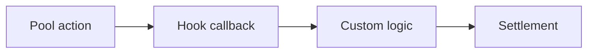

## Hooks 解决什么问题

AMM 协议的核心很稳定，但实际产品需要动态费用、限价单、TWAMM、风控、流动性激励和定制结算逻辑。Hooks 的价值在于把这些能力从核心协议中解耦出来。

## 分析框架

## 工程风险

Hooks 增强了组合能力，也扩大了攻击面。评估一个 Hook 时，不应只看功能，还要看回调时机、状态读写、资产结算和失败回滚边界。

## 建议阅读顺序

1. 先理解 v3 集中流动性。
2. 再理解 v4 singleton 架构。
3. 最后分析具体 Hook 的状态模型。
