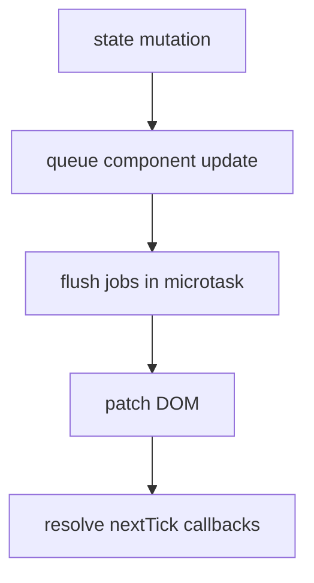

## 问题边界

`nextTick` 不是“让代码晚一点执行”的通用工具。它真正解决的是：当响应式状态变化已经进入组件更新队列后，如何在 DOM patch 完成之后执行回调。

## 调度流程



## 最小示例

```ts
import { nextTick, ref } from 'vue';

const count = ref(0);

async function increment() {
  count.value += 1;
  await nextTick();
  console.log('DOM is patched');
}
```

## 工程判断

如果代码依赖 `nextTick` 才能稳定工作，需要先确认依赖的是 DOM 更新、第三方组件生命周期，还是状态模型设计不清晰。大多数业务场景不应把 `nextTick` 当成流程控制中心。
